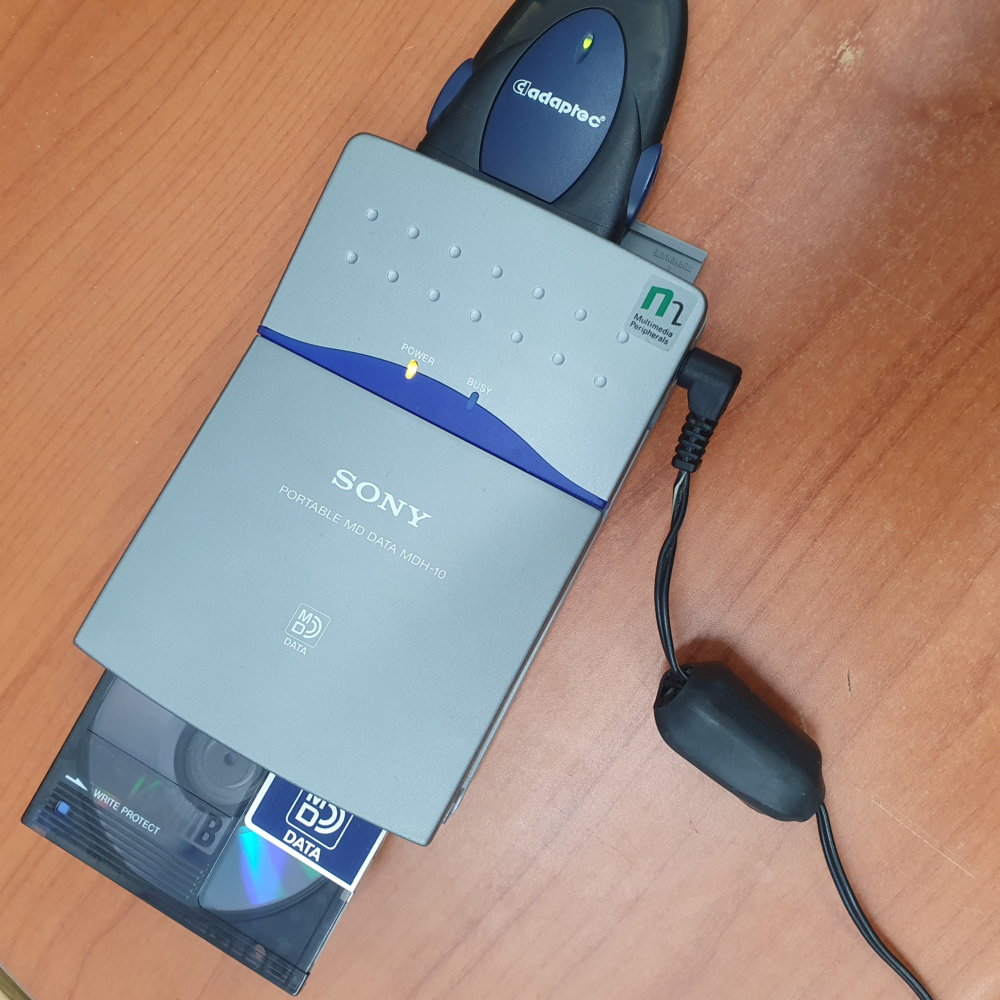

# MDH10 — Sony MD DATA 역공학 워크스페이스 (v1.0)



Sony MDH-10 (MD DATA 드라이브) 역공학 프로젝트.
MDFS 파일시스템을 분석하여 Linux에서 MD DATA 디스크를 읽고 쓸 수 있는 도구를 개발합니다.

## 주요 도구

| 도구 | 설명 | 상태 |
|------|------|------|
| **mdfs-fuse** | MDFS FUSE 드라이버 (이미지 파일 + 실제 장치) | RO/RW 동작 |
| **mdfsformat** | MDFS 포맷 도구 (빈 이미지 생성) | 동작 |
| **mdfsck-lite** | MDCTL case-9 프로토콜 검증 도구 (Rust) | 동작 |

## 빠른 시작

```bash
# 의존성 설치
sudo apt install gcc make libfuse3-dev pkg-config

# 빌드
cd mdfs-tools && make

# 이미지 마운트
mkdir -p /tmp/mdfs
./mdfs-fuse image.img /tmp/mdfs -o ro -f
```

빌드, 사용법, 옵션, 실제 장치 연결 등 상세 내용은 **[USAGE.md](USAGE.md)** 참조.

## 스펙 확보 상태

| 구조 | 상태 | 근거 |
|------|------|------|
| VD (Volume Descriptor) | **CONFIRMED** | WS78/79, 25필드 바이트 정확 오프셋 |
| VSB (Volume Space Bitmap) | **CONFIRMED** | WS80, 2-bit/AU MSB-first |
| MTB (Management Table Block) | **CONFIRMED** | WS81, TLV per-VSB FREE count |
| DRB (Directory Record Block) | **CONFIRMED** | WS82+85, 공통헤더+dir/file 확장 |
| ERB (Error Record Block) | **INFERRED** | WS83, 테스트 미디어에 데이터 없음 |
| Extent Chain | **CONFIRMED** | WS85, AFXTREC/AAEXTREC/AEXT32 코드 확인 |

P0 마운트 차단 항목 전부 해소 — 결함 없는 단일 익스텐트 디스크의 RW 마운트 가능.

## 프로젝트 구조

```
MDH10/
├── mdfs-tools/              C 기반 도구 (FUSE + format)
├── mdfs-fuse-rs/            Rust 프로토타입 (MDCTL 분석)
├── document/                스펙 문서
│   ├── MDFS_SPEC_FINAL.md     최종 스펙 (Single Source of Truth)
│   ├── MDFS_SPEC_RFC.md       RFC / 대안 해석
│   └── MDFS_EVIDENCE_GAP_AUDIT.md  증거 갭 추적
├── resource/
│   ├── analysis/            분석 워크시트 (ws01-ws85)
│   ├── work_scripts/        분석 스크립트 + 디스크 이미지
│   └── driver_legacy/       레거시 드라이버 (w31/w95/추출스크립트/QEMU도구)
├── adaptec_usbxchange/      USBXChange USB-SCSI 펌웨어 로더 (Cypress EZ-USB FX)
├── USAGE.md                 빌드 및 사용법
├── CLAUDE.md                Claude Code 지침
└── SCSI_COMMAND.txt         SCSI 명령어 레퍼런스
```

## 라이선스

역공학 연구 목적. Sony Corporation의 상표 및 기술에 대한 권리는 해당 소유자에게 있습니다.
